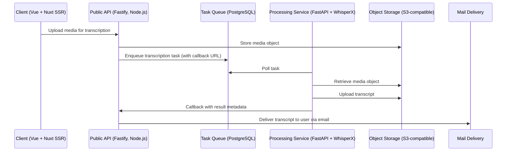
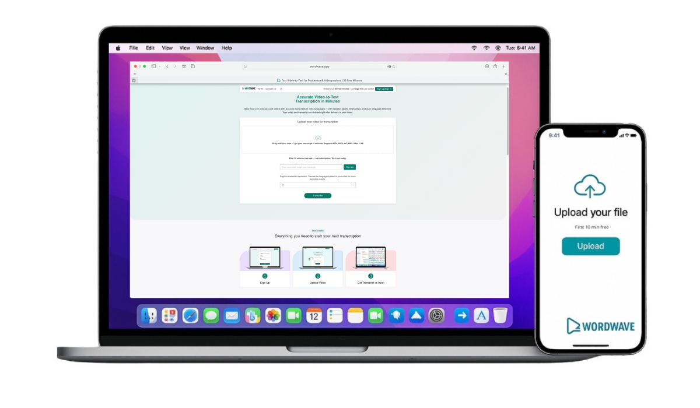
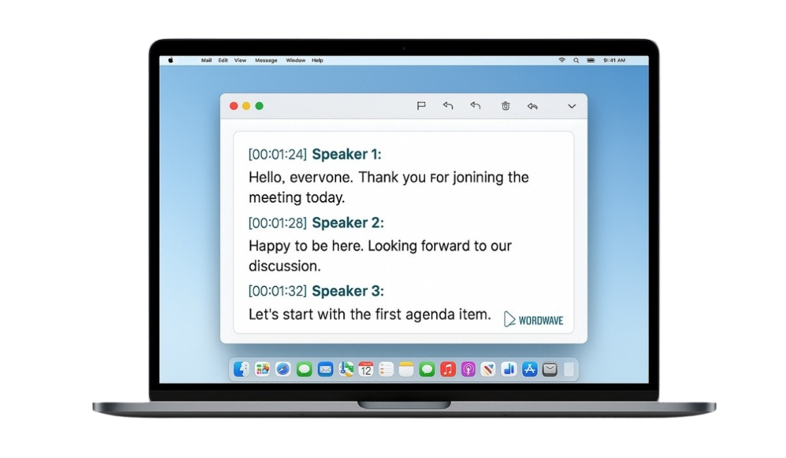

# WordWave

AI-powered transcription SaaS that converts video into structured, searchable text with timestamps and speaker identification.

## Overview
WordWave is an AI-powered transcription service that converts video content into structured, searchable text with timestamps and speaker identification.  
It processes video uploads asynchronously and delivers the final transcript as a plain-text (.txt) file to the user’s inbox.  
The system follows a modular micro-SaaS architecture that separates the interface, API, and processing layers for reliability and scalability.  
Built with a privacy-first approach, WordWave operates without exposing proprietary source code or infrastructure details.

## Technical Overview
**Frontend:** Vue 3 · Nuxt (SSR)  
**Backend:** Fastify (Node.js)  
**AI & Processing:** Python FastAPI · WhisperX  
**Infrastructure:** Docker · Object Storage (S3-compatible) · PostgreSQL (task queue)  
**Integrations:** Stripe (billing) · Mailgun (email delivery)

## System Architecture

The architecture is fully asynchronous, horizontally scalable, and deployable through containerized CI/CD pipelines.

## Key Features
- Extracts text from video files using AI models  
- Speaker detection and timestamp alignment  
- Downloadable transcripts in plain-text (.txt) format
- Automatic transcript delivery via email  
- Asynchronous task-queue processing  
- Designed for cloud or self-hosted deployment  

## Product Preview

  

  

*Interface and output examples of WordWave.*

## Status
**Active / Production MVP**  
_Source code is private. A demo is available upon request._

## Related Projects
- [CargoMagic](https://github.com/webmagic-agency/cargomagic) – desktop application for cargo volume planning and optimization  
- [RouteMagic](https://github.com/webmagic-agency/routemagic) – mobile application for route and delivery operations  

**Maintained by [WebMagic Agency](https://webmagic.agency)**  
_Custom web and AI systems for logistics, e-commerce, and SaaS._

---

### Security Disclaimer
This repository serves as a **public showcase** for demonstration purposes only.  
No source code, credentials, or proprietary infrastructure details are shared.

---

